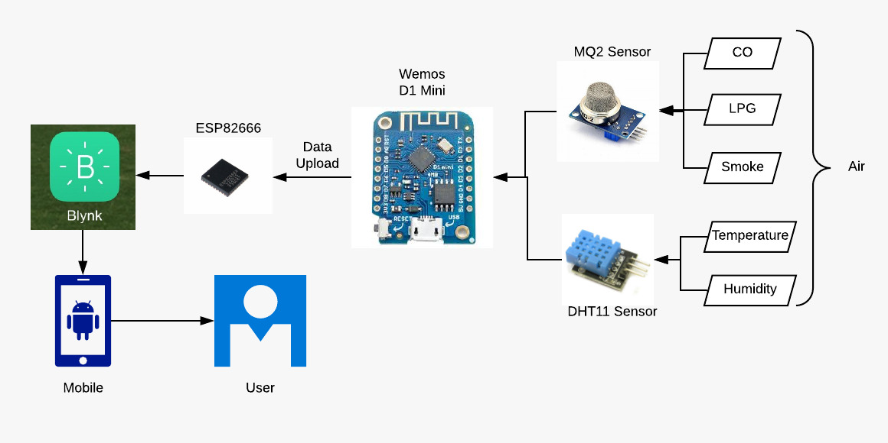

# Real-time-Gas-Detection
IOT Project
In this project we are creating a circuit which will provide the values of
1. Temperature
2. Humidity
3. Heat Index
4. value of LPG in air   (ppm)
5. value of CO in air    (ppm)
6. value of SMOKE in air (ppm)

We are using BLYNK library and app to provide the live values on mobile phone using WEMOS D1 Mini Board.

Here is a block diagram of connections

